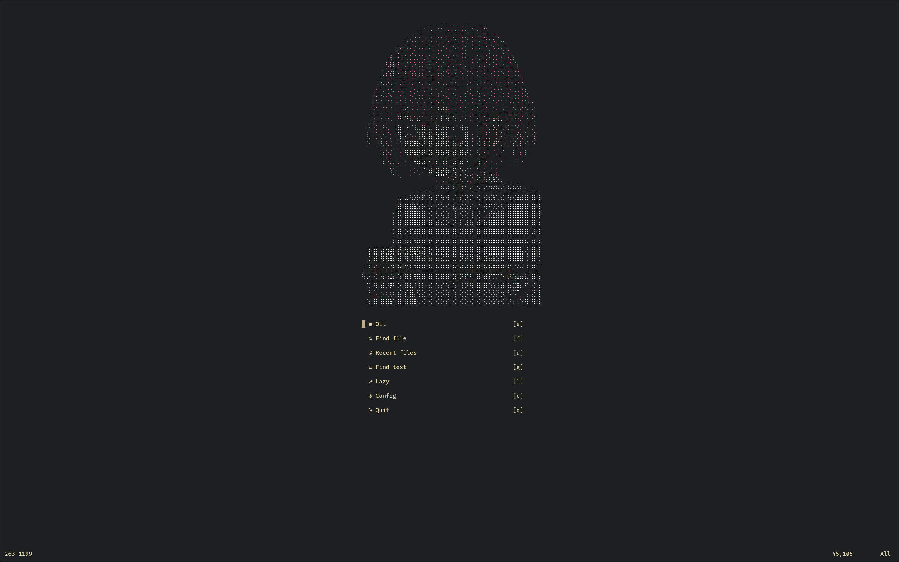

# placeholder.name

This plugin provides a customizable and visually appealing dashboard for your Neovim editor, bringing a splash of color to your coding environment. With the ability to parse ANSI colors directly using [baleia](https://github.com/m00qek/baleia.nvim). It is heavily based on [dashboard-nvim](https://github.com/nvimdev/dashboard-nvim).

---



---

- [features](#Features)
- [dependencies](#Dependencies)
- [installation](#Installation)
- [to do](#To_do)

## 🚀 Features

- select random dashboard from an array
- ansi colors support
- resizable
- easy customizable

## 🏛️ Dependencies

[baleia](https://github.com/m00qek/baleia.nvim) used for Ascii colorization.

## 📦 Installation

```lua
{
    "IJJA3141/neovim-dashboard",
    dependencies = {
	    "m00qek/baleia.nvim",
    },
    event = "VimEnter",
    lazy = true,
    init = function()
    	vim.opt.laststatus = 0
    end,
}
```

## ⚙️ Setup

You can use those types with Luacheck

```lua
--- @class dashboard
--- @field width number
--- @field height number
--- @field colors boolean
--- @field ascii string[]

--- @class keybind
--- @field icon string
--- @field key string
--- @field description string
--- @field func string | function

--- @class strict_config
--- @field top_margin number
--- @field center_margin number
--- @field bottom_min_margin number
--- @field keybinds keybind[]
--- @field keybind_max_width number
--- @field keybind_padding number
--- @field dashboards dashboard[]

--- @class config: strict_config | nil

--- @class line
--- @field icon string
--- @field left string
--- @field right string

```

To configure the plugin call setup on it and pass a configuration object. This object is composed of an array of dash board and an array of keybinds. You can take the default configuration as an exemple.

```lua
local default_opts = {
	top_margin = 2,
	center_margin = 2,
	keybind_padding = 2,
	bottom_min_margin = 2,
	keybind_max_width = 76,
	keybinds = {
		{
			key = "q",
			func = "q",
			icon = "",
			description = ":q",
		},
	},
	dashboards = {
		default = {
			width = 15,
			height = 1,
			colors = false,
			ascii = { "no config ? ಠಿ_ಠ" },
		},
	},
}

```

## To do

select dashboard by it's name

---

of course this was writen with ChatGpt...
